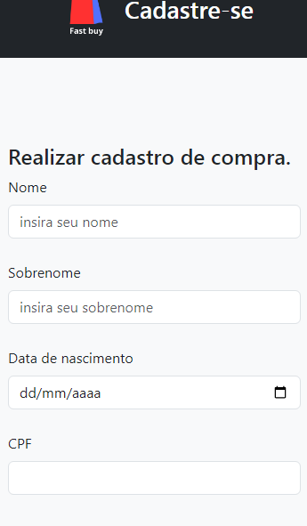
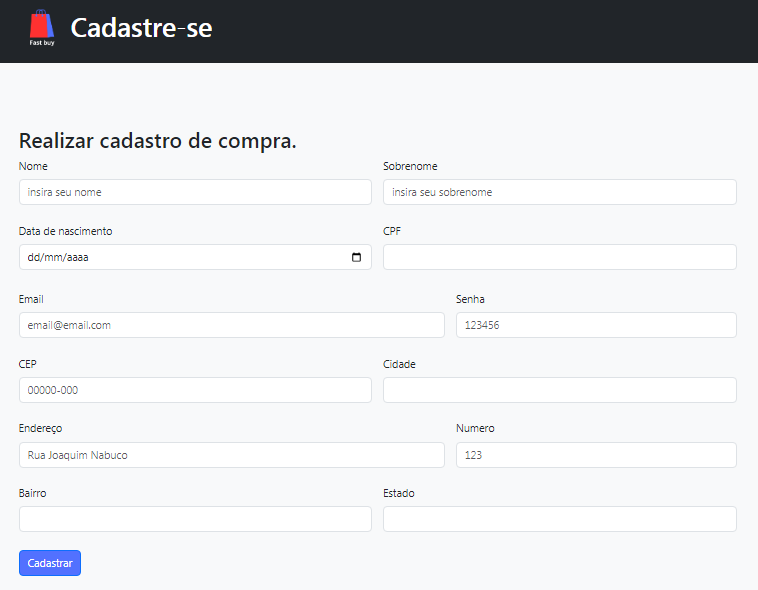

# cadastro-e-commerce

## Índice

- [**Descrição**](#descri%C3%A7ao)
- [**Pesquisa**](#%EF%B8%8F-pesquisa)
    - [**Processo de compra**](#processo-de-compra)
    - [**Similaridades e Divergências**](#similaridades-e-divergências)
    - [**Comparação de formulários**](#comparação-de-formulários)
- [**Sites de E-commerce Utilizados**](#sites-de-e-commerce-utilizados)
- [**Recursos Adicionados no Formulário**](#recursos-adicionado-no-formul%C3%A1rio)
- [**Fontes Consultadas**](#fontes-consultadas)
- [**Autor**](#autor)
- [**Contribuidores**](#autor)

# Descriçao
- O projeto consiste na realização de um **Formulário de Cadastro de E-commerce** que tenha validação de CEP e campos de informações pessoais, atraves de  pesquisas, será usado três sites de e-commerce de exemplo para saber como é feito o cadastro do usuário para realizar uma compra. 
- Sendo assim o que foi achado nas pesquisas serão aplicados ao formulário de cadastro do projeto. Que tambem será criado um README que descreve o processo de pesquisa, sites de e-commerce utilizados, similaridades e divergências entre os formulários, as fontes consultadas, recursos implementados, contribuidores do projeto e por ultimo sendo um cadastro responsivo.  

   
 

# ⚙️ Pesquisa
## Processo de compra: 
 `➔ O processo de compra no Mercado Livre em etapas:`
- Primeiro, você tem que se cadastrar ou, se já tiver, fazer login em sua conta.
- Pesquise o produto que irá comprar.
- Escolha "Comprar" ou "Adicionar ao Carrinho".
- Preencha campos para inserir o endereço de entrega e escolher a forma de pagamento.
- Revise os detalhes e confirme a sua compra.
- Conclua o pagamento.

➔ ` O processo de compra no AliExpress em etapas:`

- Primeiro, você cria uma conta e insere suas informações pessoais.
- Em seguida, procure o que você quer comprar.
- Clique em 'Comprar Agora' ou 'Adicionar ao Carrinho'.
- Insira o endereço de entrega e escolha o método de pagamento.
- Verifique tudo e, se estiver correto, confirme a compra.
- Realize o pagamento da forma escolhida.
- Após seguir as etapas, você receberá um e-mail confirmando a sua compra e poderá acompanhar o seu pedido em sua conta.

➔ `O processo de compra na Shein em etapas:`

- Primeiro, faz o cadastro e coloca suas informações lá.
- Depois, você procura o que deseja comprar no site.
- Assim quando achar, clica em 'Comprar Agora' ou 'Adicionar ao Carrinho'.
- Aí, você coloca o endereço de entrega e decide a forma que quer pagar tem diversas opçoes.
- Confere tudo, e confirme a compra.
- Por ultimo é so cocluir o Pagameto da forma que escolheu.
- Você vai receber um e-mail confirmando a sua compra e pode acompanhar o pedido na sua conta."

### Similaridades e Divergências:

 ` ➔ Similaridades`

**Informações básicas:** Os três sites solicitam informações básicas, como nome, endereço de e-mail e senha.

**Cadastro:** Os três sites começam com o processo do usuário se cadastrando e criando uma conta.

**Adicionar compra:** Após encontrar o produto desejado, em todos os casos, os usuários têm a opção de escolher "Comprar Agora" ou "Adicionar ao Carrinho".

**Confirmação da Compra:** Após revisar os detalhes, os usuários confirmam a compra e revisam os dados de entrega.

**Formas de pagamento:** Em todos os casos, o usuário seleciona uma das várias formas de pagamento para concluir a transação.

**E-mail de Confirmação:** Após a compra, os usuários recebem um e-mail de confirmação.

**Acompanhamento do Pedido:** Todos os sites permitem que os usuários acompanhem o pedido em sua própria conta.

**(UX) e (UI) presentes:** O design e a usabilidade de cada plataforma são intuitivos e orientam os usuários por etapas do processo de compra. No caso do Mercado Livre, a interface é mais simplificada e direta.

`➔ Divergências`

**Os Produtos:** Cada site tem diferentes produtos disponíveis para venda.

**Entregas:** Os prazos de entrega, os custos de frete e os cupons variam entre os sites e dependem do local de entrega.

**Interface do Usuário:** As telas de cadastro variam em design e usabilidade. Os três e-commerces usados como exemplo têm elementos visuais atraentes, mas diferentes, como cores, fontes e ordem de preenchimento.

## Comparação de formulários 

- Capturas de tela dos 3 sites utilizados:  
   
   
   

 ## Sites de E-commerce utilizados
 *Os tres sites E-commerce que eu usei como exemplo para a pesquisa e para cria o formulario foi esses:*  
[Mercado Livre](https://www.mercadolivre.com.br/)  
[AliExpress ](https://pt.aliexpress.com/)  
[Shein](https://br.shein.com/)  

   
## Recursos adicionado no formulário
* Utilizei o site [Hora de Codar ](https://horadecodar.com.br/como-validar-email-com-javascript/)para adicionar a funçao de  *Validar email* com JavaScript para verificar no formulário de cadastro se o email do visitante está correto  e utilizei para os outros campos.
* Adicionei a *validaçao do CPF*, com a ajuda de sites fiz varias pesquisas mas site que utilizei foi o [devarthu](https://devarthur.com/blog/funcao-javascript-para-validar-cpf), usei como exemplo e modifiquei bastante coisa ele.  
* Criei uma *logo* para fixar no header usando o site [Canva](https://www.canva.com/) 
* Atribui um `header` do bootstrap pois ja é responsivo.  
* adicionei uma mensagem de cadastro concluído com sucesso quando todos campos sao preencidos corretamente.

## Fontes consultadas ✍️
[Exame Invest](https://exame.com/invest/guia/o-que-e-e-commerce-red04/)  
[bootstrap](https://getbootstrap.com/)  
[Canva](https://www.canva.com/)  
[devarthu](https://devarthur.com/blog/funcao-javascript-para-validar-cpf)  
[Hora de Codar ](https://horadecodar.com.br/como-validar-email-com-javascript/)  

## Autor
- Larissa Manrique  
    -  [GitHub](https://github.com/larissassk)  
    -  [LinkedIn](https://www.linkedin.com/in/larissa-manrique/)  
    - **Contribuidores:**  
        - Amanda: [GitHub](https://github.com/amandvitoria)  
        - Lara: [GitHub](https://github.com/laraassuncao18)  

