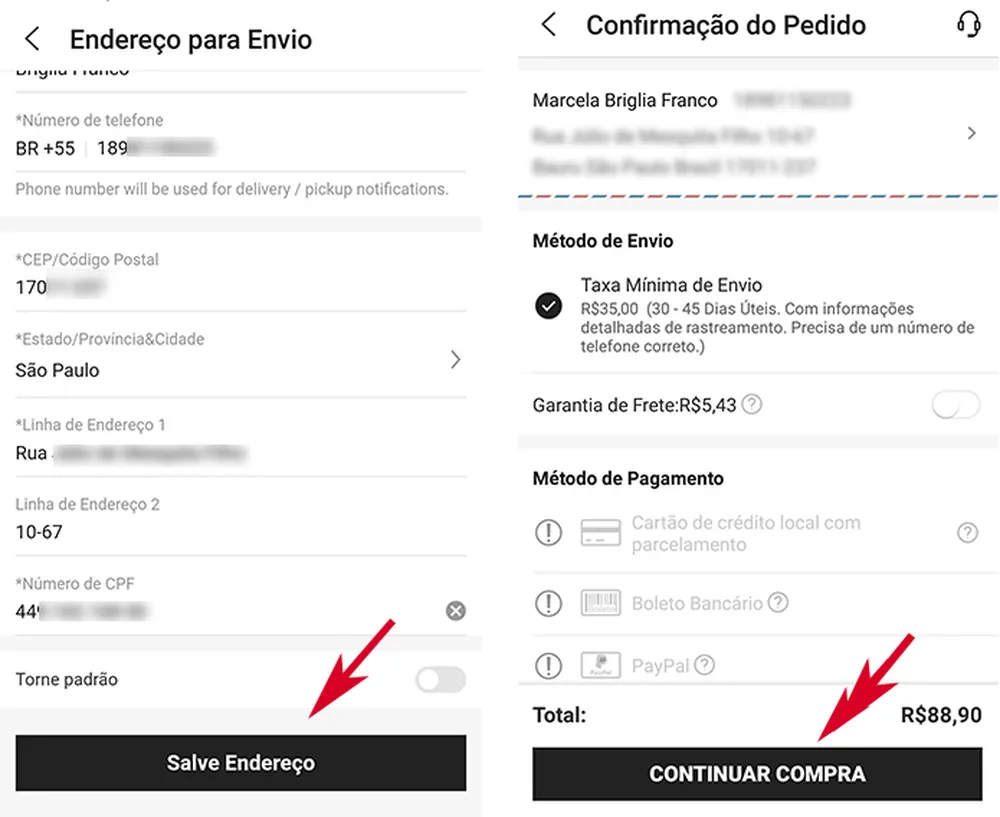

# cadastro-e-commerce

## Índice

- [Descrição](#descri%C3%A7ao)
- [Pesquisa](#%EF%B8%8F-pesquisa)
    - [Processo de compra](#processo-de-compra)
    - [Similaridades e Divergências](#similaridades-e-divergências)
    - [Comparação de formulários](#comparação-de-formulários)
- [Sites de E-commerce Utilizados](#sites-de-e-commerce-utilizados)
- [Recursos Adicionados no Formulário](#recursos-adicionado-no-formul%C3%A1rio)
- [Fontes Consultadas](#fontes-consultadas)
- [Autor](#autor)
- [Contribuidores](#autor)

# Descriçao

Nessa atividade, o objetivo é criar um **Fomulário de cadastro de E-commerce** e estudar como três sites de compras online permitem que as pessoas se cadastrem para fazer compras. Observar o que eles fazem de semelhantes e diferentes. Documetar o README o que foi pedido a atividade do teams. Em seguida, usar essas descobertas para melhorar o próprio formulário de cadastro do projeto em que será criado.
 

# ⚙️ Pesquisa
## Processo de compra: 
 ➔ `O processo de compra no Mercado Livre em etapas: `
- Primeiro vc tem que se Cadastrar ou se ja tiver o logi é so etrar em sua conta.  
 - Pesquise o produto que irá comprar.  
 - Voce escolhe "Comprar" ou "Adicionar ao Carrinho".  
 - tera campos que vc deve inserir o endereço de entrega e escolher a forma de pagamento.  
 - Confere os detalhes e confirme a sua compra.  
 - Conclua o pagamento.  
 - Irá Receber um e-mail de confirmação e depois é só acompanhar o pedido em sua conta.  

➔ ` O processo de compra no AliExpress em etapas:`

- Primeiro, você cria uma conta e coloca suas informações pessoais.
-  Em seguida procure o que você quer comprar.
- Quando encontrar o que deseja, clica em 'Comprar Agora' ou 'Adicionar ao Carrinho'.
- É só digitar o endereço de entrega e escolher como vai pagar.
- Confere tudo certinho e, se estiver tudo certo, confirma a compra.
- Paga da forma que foi escolhida.
- Seguindo as etapas, você recebe um e-mail confirmando a sua compra e pode acompanhar o seu pedido na sua conta.

➔ `O processo de compra na Shein em etapas:`

- Primeiro, faz o cadastro e coloca suas informações lá.
- Depois, você procura o que deseja comprar no site.
- Assim quando achar, clica em 'Comprar Agora' ou 'Adicionar ao Carrinho'.
- Aí, você coloca o endereço de entrega e decide a forma que quer pagar tem diversas opçoes.
- Confere tudo, e confirme a compra.
- Por ultimo é so cocluir o Pagameto da forma que escolheu.
- Você vai receber um e-mail confirmando a sua compra e pode acompanhar o pedido na sua conta."

### Similaridades e Divergências:

   ➔ `Similaridades`

  **Cadastro de Conta:** Os três sites, o processo começa com o usuário se cadastrando e criando uma conta.  
  **Pesquisa de Produtos:** Os usuários podem pesquisar os produtos que desejam comprar.  
  **Escolha de Produtos:** Após encontrar o produto desejado, em todos os casos, os usuários têm a opção de escolher "Comprar Agora" ou "Adicionar ao Carrinho".  
  **A Conferência:** Antes de confirmar a compra, os usuários têm a oportunidade de revisar os detalhes da transação, incluindo o endereço de entrega e os itens selecionados.  
  **Confirmação da Compra:** Após revisar os detalhes, os usuários confirmam a compra.  
  **Pagamento:** Em todos os casos, o usuário seleciona uma das diversas formas de pagamento para concluir.  
  **E-mail de Confirmação:** Após a compra, os usuários recebem um e-mail de confirmação.  
  **Acompanhamento do Pedido:** Todos os sites permitem que os usuários acompanhem o pedido em sua própria conta.  

  ➔ `Divergências`

 **Os Produtos:** Cada site tem diferentes produtos disponíveis para venda.  
 **Entregas:** variam em prazos, fretes, cupom e custos entre os sites e dependem do local de entrega a forma que será aplicada.  
 **O Site:** O design e sua usabilidade sao diferentes, cada plataforma tem sua própria paleta de cor, ordem de etapas do preenchimento.  

## Comparação de formulários 
 -Fotos de tela dos 3 sites usados
 

 ## Sites de E-commerce utilizados
 *Os tres sites E-commerce que eu usei como exemplo para a pesquisa e para cria o formulario foi esses:*  
[Mercado Livre](https://www.mercadolivre.com.br/)  
[AliExpress ](https://pt.aliexpress.com/)  
[Shein](https://br.shein.com/)  

   
## Recursos adicionado no formulário
* Utilizei o site [Hora de Codar ](https://horadecodar.com.br/como-validar-email-com-javascript/)para adicionar a funçao de  *Validar email* com JavaScript para verificar no formulário de cadastro se o email do visitante está correto  e utilizei para os outros campos.
* Adicionei a *validaçao do CPF*, com a ajuda de sites fiz varias pesquisas mas site que utilizei foi o [devarthu](https://devarthur.com/blog/funcao-javascript-para-validar-cpf), usei como exemplo e modifiquei bastante coisa ele.  
* Criei uma *logo* para fixar no header usando o site [Canva](https://www.canva.com/) 
* Atribui um `header` do bootstrap pois ja é responsivo.  
* adicionei uma mensagem de cadastro concluído com sucesso quando todos campos sao preencidos corretamente.

## Fontes consultadas
[Exame Invest](https://exame.com/invest/guia/o-que-e-e-commerce-red04/)  
[bootstrap](https://getbootstrap.com/)  
[Canva](https://www.canva.com/)  
[devarthu](https://devarthur.com/blog/funcao-javascript-para-validar-cpf)  
[Hora de Codar ](https://horadecodar.com.br/como-validar-email-com-javascript/)  

## Autor
- Larissa Manrique
    - GitHub: [larissassk](https://github.com/larissassk)
    - LinkedIn: [Larissa Manrique](https://www.linkedin.com/in/larissa-manrique/)
    - **Contribuidores:**
        - Amanda: [amandvitoria](https://github.com/amandvitoria)
        - Lara: [laraassuncao18](https://github.com/laraassuncao18)

